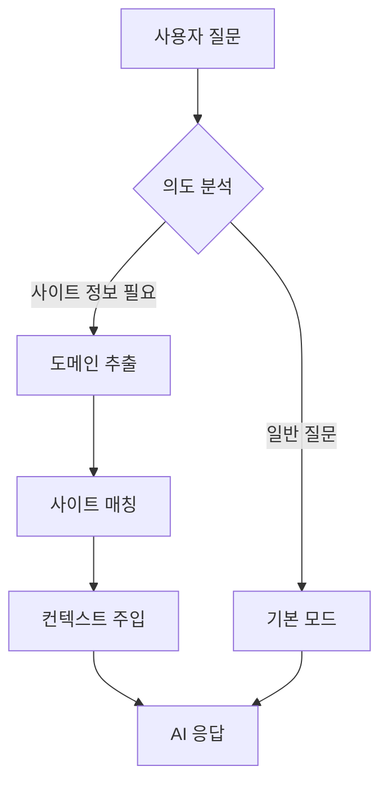

# 멀티 턴 프롬프트 - 사이트 정보 관리 가이드

## 📋 개요

식탁보 AI는 사용자의 의도를 자동으로 분석하여, 특정 금융기관이나 공공기관에 대한 질문일 경우 관련 사이트의 상세 정보를 동적으로 주입합니다. 이를 통해 정확한 URL과 서비스 위치를 안내할 수 있습니다.

## 🔄 동작 원리



### 단계별 설명

1. **의도 분석**: 사용자 질문에서 특정 사이트 정보가 필요한지 판단
2. **도메인 추출**: 관련 도메인(예: kbstar.com, hometax.go.kr) 추출
3. **사이트 매칭**: GitHub의 `sites.json`에서 해당 도메인과 일치하는 사이트 검색
4. **컨텍스트 주입**: 매칭된 사이트의 상세 정보를 프롬프트에 추가
5. **AI 응답**: 풍부한 컨텍스트를 바탕으로 정확한 답변 생성

## 📂 sites.json 파일 위치

사이트 정보는 다음 위치에 JSON 파일로 관리됩니다:

```
https://raw.githubusercontent.com/yourtablecloth/TableClothCatalog/main/docs/sites.json
```

## 📝 sites.json 구조

```json
{
  "sites": [
    {
      "displayName": "KB국민은행",
      "domain": "kbstar.com",
      "url": "https://www.kbstar.com",
      "category": "금융",
      "subpages": [
        {
          "name": "개인뱅킹 로그인",
          "url": "https://obank.kbstar.com/quics?page=C025255",
          "description": "개인 인터넷뱅킹 서비스 로그인"
        },
        {
          "name": "공인인증센터",
          "url": "https://obank.kbstar.com/quics?page=C021744",
          "description": "공동인증서 발급/재발급"
        }
      ]
    }
  ]
}
```

### 필드 설명

| 필드 | 필수 | 설명 |
|------|------|------|
| `displayName` | ✅ | 사용자에게 표시되는 이름 (예: "KB국민은행") |
| `domain` | ⚠️ | 매칭에 사용되는 대표 도메인 (예: "kbstar.com") |
| `url` | ✅ | 사이트 대표 URL |
| `category` | ❌ | 분류 (예: "금융", "공공기관") |
| `subpages` | ⚠️ | 주요 서비스 페이지 목록 (배열) |
| `subpages[].name` | ✅ | 서비스 이름 |
| `subpages[].url` | ✅ | 서비스 직접 접근 URL |
| `subpages[].description` | ❌ | 서비스 설명 |

## 🔧 사이트 추가 방법

### 1. GitHub에서 직접 편집

1. [TableClothCatalog 저장소](https://github.com/yourtablecloth/TableClothCatalog) 방문
2. `docs/sites.json` 파일 열기
3. 편집 버튼(✏️) 클릭
4. 새 사이트 정보 추가:

```json
{
  "displayName": "새은행",
  "domain": "newbank.com",
  "url": "https://www.newbank.com",
  "category": "금융",
  "subpages": [
    {
      "name": "개인뱅킹",
      "url": "https://ib.newbank.com/login",
      "description": "개인 인터넷뱅킹"
    }
  ]
}
```

5. 커밋 메시지 작성 후 저장
6. **즉시 반영**: 별도 배포 없이 1시간 내 자동 적용

### 2. Pull Request로 기여

```bash
git clone https://github.com/yourtablecloth/TableClothCatalog.git
cd TableClothCatalog
git checkout -b add-new-bank

# docs/sites.json 편집
code docs/sites.json

git add docs/sites.json
git commit -m "feat: 새은행 정보 추가"
git push origin add-new-bank

# GitHub에서 Pull Request 생성
```

## 💡 작성 팁

### 1. 도메인 매칭 전략

사용자가 "KB국민은행"이라고 말하면, 시스템은 다음을 시도합니다:
- `domain` 필드와 매칭 (예: "kbstar.com")
- `url` 필드와 매칭
- `displayName` 필드와 매칭

**권장**: 가장 대표적인 도메인을 `domain` 필드에 명시

### 2. Subpages 우선순위

사용자가 자주 찾는 페이지 순서대로 나열:
1. 로그인 페이지
2. 공인인증서 관련
3. 주요 서비스

### 3. Description 작성 가이드

- 명확하고 간결하게
- 사용자가 검색할 만한 키워드 포함
- 예: "공동인증서 발급/재발급 (구 공인인증서)"

## 🚀 성능 최적화

### 캐싱 전략

- **클라이언트 메모리 캐시**: 1시간 동안 유지
- **첫 로드 후**: 네트워크 요청 없이 즉시 응답
- **자동 갱신**: 1시간 후 백그라운드에서 업데이트

### 파일 크기 관리

현재는 JSON을 사용하지만, 사이트가 **1,000개 이상**으로 늘어나면:

```bash
# gzip 압축 버전 생성
gzip -c sites.json > sites.json.gz
```

코드에서 자동으로 압축 버전을 우선 로드합니다.

## 📊 사용 예시

### 예시 1: KB국민은행 로그인

**사용자 질문**: "KB국민은행 로그인하는 방법"

**시스템 동작**:
1. 의도 분석 → 사이트 정보 필요 ✅
2. 도메인 추출 → `["kbstar.com"]`
3. 사이트 매칭 → KB국민은행 정보 로드
4. AI 응답:
   ```
   KB국민은행 개인뱅킹 로그인은 다음 페이지에서 하실 수 있습니다:
   https://obank.kbstar.com/quics?page=C025255
   
   로그인 시 공동인증서가 필요하며...
   ```

### 예시 2: 일반 질문

**사용자 질문**: "Windows Sandbox가 뭐예요?"

**시스템 동작**:
1. 의도 분석 → 사이트 정보 불필요 ❌
2. **기본 모드로 진행** (멀티 턴 프롬프트 생략)
3. AI 응답: Windows Sandbox 개념 설명

## 🔍 디버깅

### 브라우저 콘솔에서 확인

```javascript
// F12 → Console 탭에서 다음 로그 확인:
// 🔍 1단계: 사용자 의도 분석 중...
// ✅ 사이트 정보 필요: kbstar.com
// 🔍 2단계: 매칭되는 사이트 검색 중...
// ✅ 1개 사이트 매칭 완료
// 🔍 3단계: 컨텍스트 프롬프트 구성 중...
// ✅ 멀티 턴 프롬프트 적용 완료
```

### 로컬 테스트

샘플 파일을 사용하여 로컬에서 테스트:
```csharp
// IntentBasedContextService.cs에서 URL 변경
var url = "/data/sites-sample.json"; // 로컬 파일
```

## 📞 문의 및 기여

- **이슈**: [GitHub Issues](https://github.com/yourtablecloth/TableClothLite/issues)
- **Pull Request**: 언제나 환영합니다!
- **토론**: [GitHub Discussions](https://github.com/yourtablecloth/TableClothLite/discussions)

## 📜 라이선스

이 프로젝트는 AGPL v3 라이선스를 따릅니다.

---

**마지막 업데이트**: 2025-01-05
